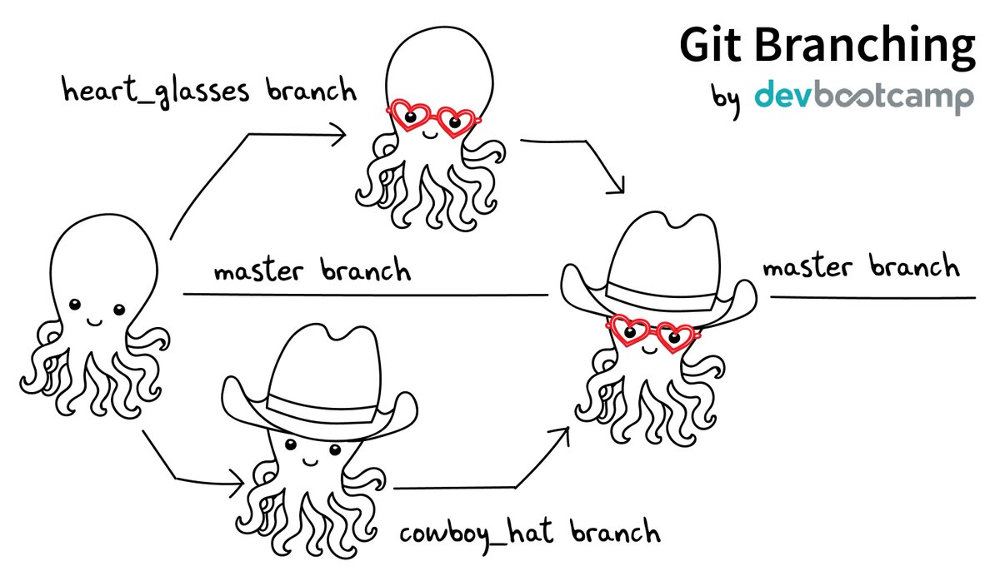
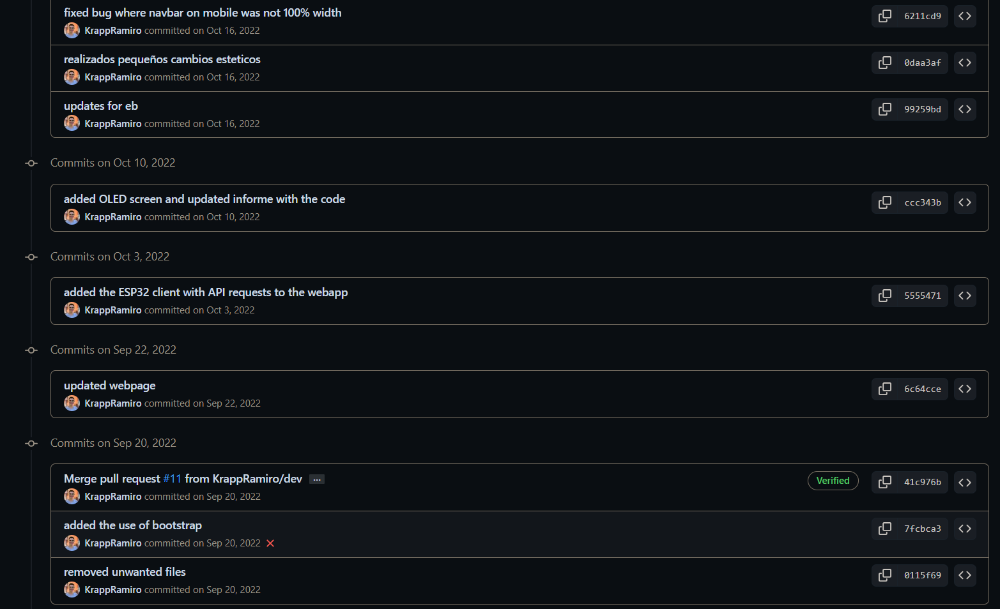
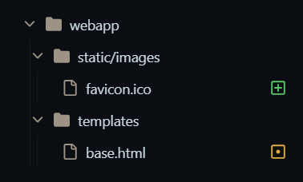
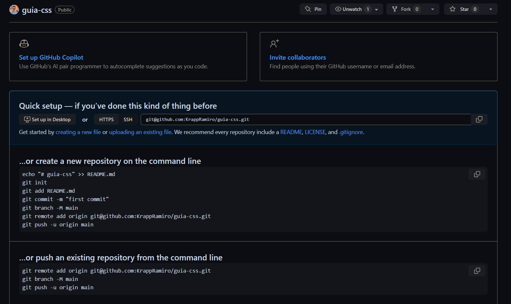

# Módulo 1 | Básico

- [Módulo 1 | Básico](#módulo-1--básico)
  - [¿Qué es Git 🤔?](#qué-es-git-)
  - [¿Por qué usar Git 🤷?](#por-qué-usar-git-)
  - [¿Puedo evitar Git? 🛑](#puedo-evitar-git-)
  - [Cheatsheet de Git 📰](#cheatsheet-de-git-)
  - [Conceptos claves de Git 📖](#conceptos-claves-de-git-)
    - [Commit](#commit)
    - [Que es una branch](#que-es-una-branch)
      - [Cómo funciona esto de las branchs?](#cómo-funciona-esto-de-las-branchs)
      - [La branch principal se llama master o main?](#la-branch-principal-se-llama-master-o-main)
  - [Mi primer proyecto en git 😇](#mi-primer-proyecto-en-git-)
    - [Los archivos en Git 📂](#los-archivos-en-git-)
    - [Mi primer commit ➡️](#mi-primer-commit-️)
    - [Repositorios remotos y Github 🐙](#repositorios-remotos-y-github-)
      - [⚠️ LEE ESTO, TE VA A SALVAR DOLORES DE CABEZA](#️-lee-esto-te-va-a-salvar-dolores-de-cabeza)
  - [Otros conceptos IGUAL DE IMPORTANTES](#otros-conceptos-igual-de-importantes)
    - [La carpeta .git/](#la-carpeta-git)
    - [Cómo ignorar carpetas y archivos usando .gitignore](#cómo-ignorar-carpetas-y-archivos-usando-gitignore)
      - [gitignore de ejemplo](#gitignore-de-ejemplo)
  - [Guía de instalación](#guía-de-instalación)
    - [Windows](#windows)
    - [Linux](#linux)
    - [Configuracion Inicial](#configuracion-inicial)

Esta guía está hecha para que sea un paseo leerla, la idea no es que sea un manual técnico, sino que sigas **paso a paso**. Esta pensada para gente que recien empieza con git, y quiere entender, dentro de todo, qué es lo que está haciendo.

## ¿Qué es Git 🤔?

> ❗ Advertencia: Descripción genérica (pero no por eso menos importante) a continuación. Leela, dale.

Git es un sistema de control de versiones ampliamente utilizado en el desarrollo de software. Te permite realizar un seguimiento de los cambios realizados en los archivos a lo largo del tiempo, lo cual es especialmente útil cuando trabajas en colaboración con otras personas.

En lugar de simplemente guardar una única copia de un archivo, Git almacena un historial completo de cambios o versiones de ese archivo. Esto significa que podés retroceder en el tiempo y ver cómo ha evolucionado el archivo en cada paso. También podés comparar diferentes versiones y fusionar cambios realizados por diferentes personas de manera eficiente.

Git utiliza un repositorio para almacenar toda la información relacionada con tu proyecto, incluyendo el historial de cambios y las diferentes ramas de desarrollo. Un repositorio puede estar en tu máquina local o en un servidor remoto. Incluso podés trabajar sin conexión a internet y luego sincronizar tus cambios cuando te vuelvas a conectar.

## ¿Por qué usar Git 🤷?

Hay varias razones:

1. 😉 | Confia en mí, es una buena idea.
2. 👮 | Es un estandar de facto en la industria, si no sabes Git, estas practicamente obligado a aprender Git.
3. 📶 | Te ayuda en la organización de tus proyectos, y te evita **horrores** como tenes archivos al estilo
   `lectorJSON_v1.js`, `lectorJSON_v2.js`, `lectorJSON_final.js`, `lectorJSON_final_final_definitivo.js`, `lectorJSON_este_si_que_anda.js`.
   Con Git, podés hacer versiones de tu código que realmente tengan sentido.
   (No te sientas culpable si alguna vez hiciste lo de \_v1, \_v2, eso lo hicimos **TODOS**, la idea es abandonarlo porque **es insostenible** 🤢)
   <br>
   Por qué es malo hacer eso? Porque rastrear qué cambió, quién lo cambió y porqué se cambió, es mucho trabajo y muy tedioso. **Eso con git no pasa**.
4. 🧪 | Te permite probar y experimentar cosas en tu código.
5. 🏦 | Te permite ver que fué cambiando en tu código a lo largo del tiempo.
6. 🧑‍🤝‍🧑 | Hace que colaborar con otras personas sea **viable**.

## ¿Puedo evitar Git? 🛑

No.

Ni lo intentes.

## Cheatsheet de Git 📰

En Git, nosotros:

1. Iniciamos nuestro repositorio usando `git init`
2. Le decimos a git que archivos vamos a usar usando `git add`
3. Creamos un commit usando `git commit` (Un commit es una acción que registra y guarda los cambios realizados en los archivos, y representa una versión específica del proyecto con un mensaje descriptivo.)

**Configuración:**

```bash
# Configurar el nombre del usuario
git config --global user.name "Tu Nombre"

# Configurar el correo electrónico del usuario
git config --global user.email "tu@email.com"
```

**Creación y Clonación (usar una de las dos, no las dos):**

```bash
# Inicializar un repositorio Git en una carpeta local
git init

# Clonar un repositorio remoto a tu máquina local
git clone <URL_del_repositorio>
```

**Trabajo con Archivos:**

```bash
# Añadir cambios al área de preparación para un commit
git add <nombre_del_archivo>

# Añadir todos los archivos modificados al área de preparación
git add .

# Realizar un commit con un mensaje descriptivo
git commit -m "Mensaje del commit"
```

**Estado y Registro de Cambios:**

```bash
# Ver el estado actual del repositorio
git status

# Ver los cambios realizados en los archivos
git diff

# Ver el historial de commits
git log
```

**Ramas:**

```bash
# Ver las ramas existentes y la rama actual
git branch

# Crear una nueva rama
git branch <nombre_de_rama>

# Cambiar a una rama específica
git checkout <nombre_de_rama>
```

**Trabajo Remoto:**

```bash
# Ver los repositorios remotos asociados
git remote -v

# Enviar cambios locales al repositorio remoto
git push origin <nombre_de_rama>

# Obtener cambios del repositorio remoto
git pull origin <nombre_de_rama>
```

**Fusión:**

```bash
# Fusionar cambios de una rama en la rama actual
git merge <nombre_de_otra_rama>
```

## Conceptos claves de Git 📖

### Commit

Imaginemos que tienes un archivo llamado "script.py" con el siguiente contenido:

```
print("Hola, mundo!")
```

Ahora, realizas una modificación en el archivo y agregas una línea adicional:

```
print("Hola, mundo!")
print("¡Bienvenidos!")
```

Cuando haces un commit, estás guardando estos cambios como una versión específica del proyecto. Visualmente, puedes verlo de la siguiente manera:

Antes del commit:

```
Archivo: script.py

print("Hola, mundo!")
```

Después del commit:

```
Archivo: script.py

print("Hola, mundo!")
print("¡Bienvenidos!")
```

```mermaid
gitGraph
	commit id: "Commit Inicial"
	commit id: "Agregar saludo adicional"
```

El commit se registra con un mensaje descriptivo, como "Agrega saludo adicional". Este mensaje ayuda a identificar rápidamente los cambios realizados en ese commit en particular.

En resumen, un commit en Git es como tomar una fotografía de los cambios en tus archivos en un momento específico y darle un nombre descriptivo. Te permite guardar y recuperar diferentes versiones de tu proyecto a medida que avanzas en su desarrollo.

### Que es una branch

Imagina que tienes un proyecto de desarrollo de software y quieres trabajar en una nueva funcionalidad sin afectar la versión principal del proyecto. Una branch, o rama, es como una línea de desarrollo independiente dentro de tu proyecto. **Es una forma de separar tu trabajo en diferentes áreas para realizar cambios y experimentar sin afectar la versión principal.**



Lo voy a volver a repetir y en mayusculas, como para que se entienda:

---

**UNA BRANCH, O RAMA, ES COMO UNA LÍNEA DE DESARROLLO INDEPENDIENTE DENTRO DE TU PROYECTO.**

**ES UNA FORMA DE SEPARAR TU TRABAJO EN DIFERENTES ÁREAS PARA REALIZAR CAMBIOS Y EXPERIMENTAR SIN AFECTAR LA VERSIÓN PRINCIPAL.**

---

#### Cómo funciona esto de las branchs?

Imaginate que haces un proyecto en Git, y no usas branchs. El historial de commits se vería así

```mermaid
gitGraph
    commit id: "Añadir index.html"
    commit id: "Re-estilizado de la homepage"
    commit id: "Correccion de bugs general"
```

Ahora que pasa? Imaginate que querés empezar a testear una nueva feature. Suponete que querés agregar animaciones, pero no estas del todo seguro de si van a quedar bien o no.

Si tenés dos dedos de frente, lo que más conviene es hacer una branch especificamente para developear animaciones

```mermaid
gitGraph
    commit id: "Añadir index.html"
    commit id: "Re-estilizado de la homepage"
    commit id: "Correccion de bugs general"
    branch develop-animaciones
    commit id: "Añadir animacion a la homepage"
    commit id: "Añadir animaciones a la pagina de registro y login"
    commit id: "Fixear bug en las animaciones de la homepage"
```

Mientras tanto, podes seguir haciendo cosas en la branch `main`, **porque `develop-animaciones` y `main` ESTAN AISLADAS**

Por ejemplo, aca deje de trabajar en las animaciones para hacer un poco de trabajo en el main

```mermaid
gitGraph
    commit id: "Añadir index.html"
    commit id: "Re-estilizado de la homepage"
    commit id: "Correccion de bugs general"
    branch develop-animaciones
    commit id: "Añadir animacion a la homepage"
    commit id: "Añadir animaciones a la pagina de registro y login"
    commit id: "Fixear bug en las animaciones de la homepage"
    checkout main
    commit id: "Añadir footer"
    commit id: "Optimizar BBDD"
```

Cuando se que terminé con las animaciones, puedo hacer un merge

```mermaid
gitGraph
    commit id: "Añadir index.html"
    commit id: "Re-estilizado de la homepage"
    commit id: "Correccion de bugs general"
    branch develop-animaciones
    commit id: "Añadir animacion a la homepage"
    commit id: "Añadir animaciones a la pagina de registro y login"
    commit id: "Fixear bug en las animaciones de la homepage"
    checkout main
    commit id: "Añadir footer"
    commit id: "Optimizar BBDD"
    merge develop-animaciones
    commit id: "Sigo trabajando..."
```

#### La branch principal se llama master o main?

Sobre si se dice master o main, hay una discusion gigante al respecto.

Para hacerla corta, antes a la branch principal se le decía master, pero la comunidad esta transicionando hacia main.

## Mi primer proyecto en git 😇

> ⚠️ Fuera de todo chiste, **git realmente es dificil de entender a la primera**, no te angusties si sentís que es dificil, es porque lo es. Pero tranqui, ya lo vas a entender 😄, vos podés!

Lo primero que tenés que hacer es [instalar Git](#guía-de-instalación).
Una vez que tenés Git instalado, podés **crear tu primer repositorio**:

1. Usando la terminal (bash especificamente, la que esta por defecto en Linux. Si estas en Windows, vas a tener que instalar Git Bash, no vale usar CMD o Powershell.)
   crea la carpeta que vamos a usar para aprender git, la vamos a crear usando el comando de bash llamado `mkdir`,
   que sirve para crear un directorio (o sea, una carpeta)

   ```bash
   mkdir usando_git
   ```

   Esto crea una carpeta llamada usando_git

2. Metete a la carpeta `usando_git` usando `cd`, otro comando de bash que siginifica **c**hange **d**irectory

   ```bash
   cd usando_git
   ```

3. Una vez adentro de `usando_git/`, **inicia el repositorio**
   ```bash
   git init
   ```

### Los archivos en Git 📂

La realidad es que git, cuando inicias el repositorio por primera vez, **no tiene ni idea de qué querés hacer con tus archivos**.
_Eso se lo vas a tener que indicar vos._

Para que me entiendas, usa el comando `git status`. Vas a ver que te dice:

```bash
On branch main

No commits yet

nothing to commit (create/copy files and use "git add" to track)
```

Primero te dice que estas en la branch main (despues vamos a ver branchs, tranqui). Despues te dice que no hay commits todavia, y termina con que no hay nada para commitear, que hay que crear archivos y comenzar a trackearlos con `git add`. En eso quiero hacer foco, **hay que crear nuestros primeros archivos**

Para crear unos archivos, usa `touch`, que sirve para crear archivos

```bash
touch script.py index.html style.css index.js
```

Eso te debería crear los siguientes archivos:

```bash
.
├── index.html
├── index.js
├── script.py
└── style.css
```

Ahora, si le preguntamos a git sobre nuestros archivos usando `git status`, nos va a decir lo siguiente:

```bash
On branch main

No commits yet

Untracked files:
  (use "git add <file>..." to include in what will be committed)
        index.html
        index.js
        script.py
        style.css

nothing added to commit but untracked files present (use "git add" to track)
```

Ahora nos sigue diciendo que estamos en main y que no tenemos commits, pero **algo cambió! Ahora nos dice que hay Untracked files! Qué es esto?**

Bueno, a git hay que decirle **a mano** que archivos queremos añadir para ser incluidos en nuestro próximo commit, la próxima versión de nuestro código.

Si yo quisiera simplemente incluir el archivo `index.html` al repositorio, tendría que hacer `git add index.html`. Para ver el resultado de esto, basta con hacer `git status`:

```bash
On branch main

No commits yet

Changes to be committed:
  (use "git rm --cached <file>..." to unstage)
        new file:   index.html

Untracked files:
  (use "git add <file>..." to include in what will be committed)
        index.js
        script.py
        style.css
```

Ahora podemos ver que index.html salió de Untracked, y esta en una nueva sección llamada **Changes to be committed**. Esto significa que este archivo va a estar incluido en nuestro próximo **commit** (o versión).

### Mi primer commit ➡️

Ahora vamos a hacer nuestro primer commit. [Qué es un commit?](#commit) Un commit es una versión de tu código, es como **una imagen de como era tu proyecto en un punto específico del tiempo**.

Por ejemplo, en un proyecto personal mío, yo tuve estos commits:



En cada commit, hice cambios en ciertas funcionalidades del proyecto. Por ejemplo, hay un commit que dice `added favicon`. En ese commit, lo único que hice fue añadir un favicon (si, un commit bastante idiota, pero me había olvidado del favicon)

Como en ese commit quería agregar un favicon, agregue el archivo favicon.ico y modifique el .html para quje lo incluya:



**Ahora que tenés un ejemplo de cómo es un commit, vamos a hacer nuestro primer commit, en donde commiteamos index.html:**

1. Revisamos que archivos estamos trackeando

   ```bash
   git status
   ```

2. Ya teniendo nuestros archivos agregados con `git add`, hacemos nuestro commit con un mensaje descriptivo

   ```bash
   git commit -m "Añadir version inicial de index.html"
   ```

---

Ahora imaginemos que queremos hacer otro commit, donde agregamos nuestros archivos .js y .css. ¿Cómo hacemos?

1. Añadimos los archivos

   ```bash
   git add style.css index.js
   ```

2. Committeamos los archivos

   ```bash
   git commit -m "añadir estilos y scripts"
   ```

Y listo! Podes ver el historial de commits usando `git log`, arriba aparece el más reciente.

```bash
commit a62433aa7e9bf4601b5ac78537b2f7819c2223e8 (HEAD -> main)
Author: Krapp Ramiro <krappramiro@disroot.org>
Date:   Tue Jul 4 11:51:51 2023 -0300

    añadir estilos y scripts

commit 41b3db73b371630b5486f208e51111e00faf0ae1
Author: Krapp Ramiro <krappramiro@disroot.org>
Date:   Tue Jul 4 11:51:19 2023 -0300

    Añadir version inicial de index.html
```

### Repositorios remotos y Github 🐙

Este repositorio que hicimos esta guardado localmente en nuestra computadora, pero qué pasa si queremos colaborar con otras personas? Para eso usamos una **plataforma de repositorios remotos**.
Hay un montón, está bitbucket, gitlab, gitkraken, etc... Pero la más conocida es **Github**. Github te permite "subir" (entre muchas **MUCHISIMAS** comillas)
tus repositorios a internet, permitiendo que otras personas lo vean y colaboren en un mismo proyecto.

Para hacer esto, ya hay guías en internet.

Tambien podes clonar un repositorio ya existente, usando

```bash
git clone https://github.com/Usuario/nombre-del-repo
```

Obviamente reemplazando el link

#### ⚠️ LEE ESTO, TE VA A SALVAR DOLORES DE CABEZA

Cuando quieras subir tu repositorio local (en tu PC) a uno remoto, tenés que tener en cuenta lo siguiente **SI o SI**

- El repositorio local ya tiene que haber tenido su primer commit
- El repositorio remoto tiene que estar completamente vacío, se tiene que ver así

  

## Otros conceptos IGUAL DE IMPORTANTES

### La carpeta .git/

Cuando haces o clonas un repositorio de Git, este crea una carpeta llamada .git/

Esta carpeta contiene los archivos que hacen que el repositorio funcione. Si no hay una carpeta .git/ en la carpeta, Git no reconoce que exista un repositorio.

**NO LA BORRES**

### Cómo ignorar carpetas y archivos usando .gitignore

El archivo .gitignore es un archivo especial utilizado en Git para indicar qué archivos y directorios deben ser ignorados y no deben ser rastreados por el sistema de control de versiones.

Cuando trabajas en un proyecto de desarrollo, es común tener archivos y directorios que no querés que sean incluidos en el repositorio Git, como archivos de configuración local, archivos temporales, registros de errores o archivos generados automáticamente. Estos archivos **no son relevantes para el control de versiones** y agregarlos al repositorio puede ser innecesario y generar ruido en el historial de cambios.

**El archivo .gitignore te permite especificar patrones de nombres de archivos o directorios que deben ser ignorados por Git**. Estos patrones pueden ser nombres específicos, extensiones de archivos o incluso patrones más complejos utilizando caracteres comodín.

Por ejemplo, si querés ignorar todos los archivos .txt en tu proyecto, simplemente puedes agregar la línea `*.txt` al archivo .gitignore. Esto le indica a Git que ignore todos los archivos con la extensión `.txt` en cualquier ubicación del proyecto.

El archivo .gitignore se coloca en la raíz del repositorio o en los directorios específicos donde querés aplicar las reglas de ignorar archivos. Puedes tener múltiples archivos .gitignore en diferentes ubicaciones dentro de tu proyecto.

Es importante tener en cuenta que el archivo .gitignore solo afecta a los archivos que aún no han sido rastreados por Git. Si ya has agregado un archivo al repositorio antes de agregarlo al archivo .gitignore, deberás eliminarlo explícitamente del repositorio para que Git lo ignore en el futuro.

> 💡 Github mantiene una lista de archivos .gitignore específicos para una gran variedad de proyectos y lenguajes, si querés tener un punto inicial para tu proyecto:
> https://github.com/github/gitignore

#### gitignore de ejemplo

```bash
# Comentarios: inician con el símbolo de numeral

# Ignorar archivos de compilación
*.exe
*.dll
*.class

# Ignorar directorios
logs/
temp/

# Ignorar archivos de configuración local
config.ini
database.yml

# Ignorar archivos generados automáticamente
dist/
build/

# Ignorar archivos sensibles o con información privada
secrets.txt
credentials.json

# Ignorar archivos de dependencias
/node_modules
/.venv

# Ignorar archivos específicos por su ruta relativa
src/example/file.txt

# Ignorar todos los archivos con una extensión específica en un directorio
assets/*.jpg

```

## Guía de instalación

### Windows

> 😢 Con todo mi corazón, te digo que duele que programes en windows. Probá cuando puedas usando WSL, o conectandote por SSH a un server Linux

Usa [esta guía](https://platzi.com/clases/1557-git-github/19933-instalando-git-y-gitbash-en-windows/)

### Linux

Asumiendo que estas usando alguna distribución basada en Debian/Ubuntu, abrí la terminal y ejecuta los siguientes comandos:

```bash
sudo apt update
sudo apt install git
```

Verifica que la instalación se haya hecho correctamente usando el comando: `git –-version.`

Si no estas usando una distribución basada en Debian, [usa el package manager de tu distribución en vez de apt](https://git-scm.com/download/linux).

### Configuracion Inicial

Cuando instalas git por primera vez, tenés que configurar 2 cositas:

1. Tu identificación
2. El nombre por defecto de las branchs. [¿Por qué? En esta parte del documento lo explico, tocame, soy un link!](#la-branch-principal-se-llama-master-o-main)

**La identificación se hace así:**

```bash
# Configurar el nombre del usuario
git config --global user.name "Tu Nombre"

# Configurar el correo electrónico del usuario
git config --global user.email "tu@email.com"
```

Recorda cambiar el nombre y el email segun tus datos

**El nombre por defecto de las branchs se hace así**

```bash
git config --global init.defaultBranch main
```

<!-- Links -->
