# Módulo 2 | Avanzado

> Sección en progreso... 👷

- [Módulo 2 | Avanzado](#módulo-2--avanzado)
	- [Las 3 ubicaciones de tus archivos](#las-3-ubicaciones-de-tus-archivos)
	- [Los 4 estados de tus archivos y el ciclo de vida del estado](#los-4-estados-de-tus-archivos-y-el-ciclo-de-vida-del-estado)
		- [TLDR](#tldr)
		- [Explicación detallada](#explicación-detallada)
	- [Diferencia entre las 3 ubicaciones y los 4 estados](#diferencia-entre-las-3-ubicaciones-y-los-4-estados)
	- [Repositorios remotos ☁️](#repositorios-remotos-️)
		- [Ver tus remotos](#ver-tus-remotos)
		- [Agregar remotos](#agregar-remotos)
	- [Git Branching, merging, rebase y sufrimiento](#git-branching-merging-rebase-y-sufrimiento)
		- [¿Qué es un puntero? ¿Qué es HEAD?](#qué-es-un-puntero-qué-es-head)
		- [Branches in a nutshell](#branches-in-a-nutshell)
				- [Entonces que es una branch?](#entonces-que-es-una-branch)
			- [Creando una nueva branch](#creando-una-nueva-branch)
			- [Switcheando branches](#switcheando-branches)
		- [Branching y Merging básico, rebase](#branching-y-merging-básico-rebase)
	- [Felicitaciones!](#felicitaciones)

Bienvenido al módulo 2. Este es un módulo más teórico, pero **fundamental** si realmente querés aprender Git.

Esta sección esta basada en el libro Pro Git, recomendadisimo.

[Link al libro en Ingles](https://git-scm.com/book/en/v2) **(RECOMENDADO)**
[Link al libro en Español](https://git-scm.com/book/es/v2)

Leertelo te va a servir para **REALMENTE APRENDER** qué es lo que hiciste en el módulo 1.

## Las 3 ubicaciones de tus archivos

Prestá atención ahora: **acá está lo principal que tenés que recordar sobre Git si querés que el resto de tu proceso de aprendizaje sea fluido**.
Git tiene tres estados en los que tus archivos pueden encontrarse:

1. modified (modificado)
2. staged (preparado)
3. comitted (confirmado)

- Modified significa que modificaste el archivo pero aún no lo añadiste para ser parte del próximo commit.
- Prepared significa que añadiste un archivo para que forme parte del siguiente commit (`git add`).
- Comitted significa que los cambios ya fueron agregados al repositorio (`git commit`).

En base a estos estados, Git tiene tres ubicaciones en las que guardar estos archivos dentro de un proyecto en Git:

- el working tree / working directory (árbol de trabajo)
- el staging area (área de preparación)
- el directorio de Git (`.git/`).

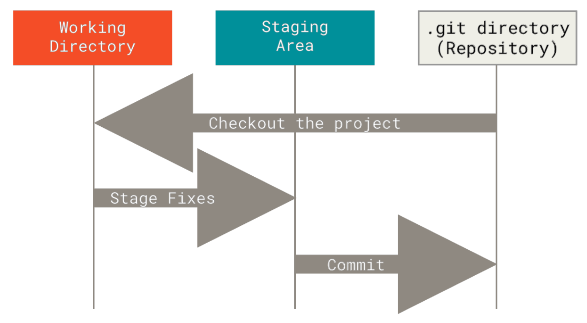

El working directory (árbol de trabajo) es el directorio donde trabajas con los archivos de tu proyecto.
Es la copia local de los archivos en tu repositorio Git.
Cuando haces cambios en tus archivos, estos cambios se reflejan en el working directory.
**es simplemente el directorio principal de tu proyecto**

El staging area (área de preparación) es una sección intermedia en Git que actúa como una zona de almacenamiento temporal.
Es donde podés seleccionar y preparar los cambios específicos que querés incluir en el próximo commit.
**Antes de comittear los cambios, tenés que agregarlos al staging area usando `git add`.**

El directorio de Git es donde Git almacena los metadatos y la base de datos de objetos de tu proyecto.
**Esta es la parte más importante de Git y es lo que se copia cuando clonas un repositorio desde otra computadora**. Acá se guardan las branches, los commits, y cosas similares.

El flujo de trabajo básico de Git es más o menos así:

1. Modificás archivos en tu working directory.
2. Preparás selectivamente solo esos cambios que querés incluir en tu próximo commit, agregándolos al staging area con `git add`.
3. Hacés un commit, que toma los archivos tal como están en el staging area y guarda esa commit en tu directorio de Git.

- Si una versión particular de un archivo está en `.git/`, se considera como comitteado.

- Si ha sido modificada y se ha agregado al staging area, ese archivo se considera como staged.

- Y si ha sido modificado desde que se comitteó pero no se ha stageado, se considera modified.

## Los 4 estados de tus archivos y el ciclo de vida del estado

### TLDR

Los archivos en Git **tienen un ciclo de vida**, y Git categoriza los archivos en 4 estados posibles **segun en que paso esten de este ciclo**.

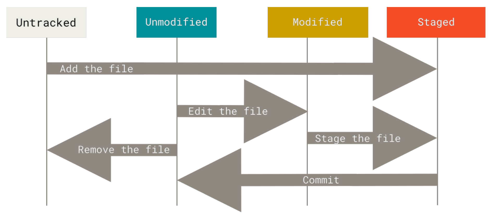

- **Untracked:** Git no está haciendo seguimiento de este archivo (jamás se lo agregó usando `git add`!).
- **Unmodified:** El archivo no fué modificado desde la última vez que se agregó al staging area (o sea, es igual a la última vez que le hiciste `git add`) **y fue comitteado, SI O SI**.
- **Modified:** El archivo fué modificado desde la última vez que se comitteo.
- **Staged:** El archivo fue añadido al staging area usando `git add`.

### Explicación detallada

Cada archivo en tu working directory puede estar en uno de 2 estados: _tracked_ o _untracked_.

Los archivos trackeados son archivos que estuvieron en el último commit o fueron agregados recientemente con `git add`.
En resumen, archivos que git hace seguimiento.

Los archivos untrackeados son todo lo demás: cualquier archivo que no estuvo en tu último commit o que no está en el staging area (o sea, nunca lo añadiste con `git add`)

A medida que editas archivos, Git los ve como modified, porque los cambiaste desde tu último commit.
A medida que vas trabajando, vas a ir seleccionando selectivamente estos archivos modificados, los vas a stagear, y los vas a commitear, _y el ciclo se repite... _


## Diferencia entre las 3 ubicaciones y los 4 estados

**Modified, Staged y Committed:** Estados en los que tus archivos pueden estar **cuando ya estan siendo rastreados por git**, cada uno tiene su "carpetita". _Esta categoria de estados habla de como se gestionan los archivos que ya fueron añadidos a Git_

**Untracked, Tracked, Modified, and Staged:** Estados por los que pasan tus archivos antes de ser rastreados y comprometidos, **es un ciclo de vida**.  _Esta categoria de estados habla del ciclo de vida de tus archivos cuando usas Git_

## Repositorios remotos ☁️

Un repositorio remoto es una versión de tu repositorio que se encuentra en un servidor y al cual varios colaboradores pueden acceder y compartir.

Cuando trabajas en un proyecto, normalmente tenés una copia local del repositorio en tu máquina, en donde haces tus commits y branches.
Sin embargo, para colaborar con otros desarrolladores _(o flexear de lo pro que sos programando 😎)_, la mejor opción es usar un repositorio remoto.

Este actúa como un punto centralizado donde los desarrolladores pueden enviar `(push)` y recibir `(pull)` los cambios realizados en el repositorio.
Esto permite a los miembros del equipo colaborar, compartiendo código y manteniendo un historial completo de las modificaciones realizadas en el proyecto.

Algunos servicios populares que hacen hosting de repositorios remotos son GitHub, GitLab, Bitbucket y Azure DevOps.
Estos servicios proporcionan características adicionales, como la gestión de problemas, la revisión de código y CI/CD, que facilitan los proyectos en equipo.

### Ver tus remotos

Para ver los remotos que tienes configurados, tenés que ejecutar el comando `git remote`.
Esto mostrará los nombres de cada uno de los remotos que tienes especificados.

Si tu repositorio lo clonaste (o sea, lo obtuviste mediante `git clone`), deberías ver al menos `origin` (origen, en inglés) - este es el nombre que por defecto Git le da al servidor del que clonaste.

Con `git remote`, veo los remotos que tengo agregados, y agregandole la flag `-v` tambien especifico que quiero ver las URLS

```bash
┌💁 krapp @ 💻 DESAP01 in 📁 guia_git on 🌿 main
└❯ git remote
azure-devops
github
```

Agregandole la flag `-v` tambien especifico que quiero ver las URLS

```bash
┌💁 krapp @ 💻 DESAP01 in 📁 guia_git on 🌿 main
└❯ git remote -v
azure-devops    git@ssh.dev.azure.com:v3/pseguros/Estrategia%20Tecnol%C3%B3gica/guia-git (fetch)
azure-devops    git@ssh.dev.azure.com:v3/pseguros/Estrategia%20Tecnol%C3%B3gica/guia-git (push)
github  git@github.com:KrappRamiro/guia-basica-git.git (fetch)
github  git@github.com:KrappRamiro/guia-basica-git.git (push)
```

### Agregar remotos

## Git Branching, merging, rebase y sufrimiento

> Vas a leer el título de esta sección y me vas a preguntar: ¿Esto no lo vimos antes?
> Si, esto lo vimos antes, pero ahora **lo vamos a ver en serio 🔥**. Anda a buscar mucho café ☕ que lo vas a necesitar.

> Aclaración: El sufrimiento del título va a ser mútuo, ustedes van a sufrir para entenderlo, y y voy a sufrir para vér cómo explicarlo sin explotarles la cabeza

> Segunda aclaración: "Branching" significa hacer branchs de forma correcta, no es ningun término muy catatónico

### ¿Qué es un puntero? ¿Qué es HEAD?

En esta sección se habla mucho de punteros, entonces consideré que era muy importante explicar que son para los que no tienen conocimientos de programación en C.

Imaginate que estás jugando un videojuego y quieres guardar tu progreso en diferentes puntos. Los punteros en Git son como "guardar partida" en esos puntos específicos de tu juego. Cuando guardas una partida, podés volver a ese punto en cualquier momento. **Git usa punteros para marcar los diferentes momentos en los que has guardado tus cambios en tu proyecto**.

**"HEAD"** es como el punto en el que te encuentras actualmente en el juego. Cuando haces cambios en tu proyecto y los guardas en Git, **"HEAD"** se mueve al nuevo punto donde has guardado tus cambios más recientes.

También podés crear diferentes "guardar partidas" llamadas branches (ramas), para experimentar con diferentes caminos en el juego sin afectar tu progreso principal.
Los punteros te ayudan a cambiar entre estas "guardar partidas" o branches(ramas) para ver cómo se ven tus cambios en cada una de ellas.

En resumen, los punteros en Git son como "guardar partida" en un videojuego, que te permiten volver a puntos específicos en tu proyecto y experimentar con diferentes caminos sin perder tu trabajo anterior.

**LOS PUNTEROS LOS USA GIT INTERNAMENTE**

### Branches in a nutshell

Para entender de verdad como es que Git hace branching (y poder sobrevivir cuando tengamos que hacer branching más adelante), tenemos que ver, de forma muy light, como es que git almacena los datos.
Git no almacena los datos como una set de cambios, sino como una serie de **snapshots** (o instantaneas).

Cuando haces un commit, Git guarda un **commit object** con los siguientes datos:

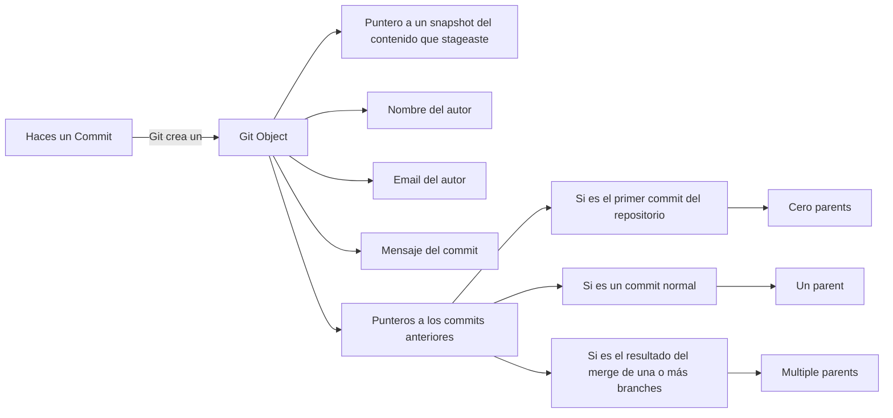

> :warning: Advertencia: A partir de aca las cosas se empiezan a completar, no te preocupes si lo ves dificil. Es que **es dificil**, por eso le ponemos grafiquitos :smile:

Para visualizar esto, asumamos que tenes un directorio con 3 archivos, y los stageas y commiteas.
Stagear los archivos ejecuta las siguientes acciones por cada archivo:

- Crea un CHECKSUM _(como por ejemplo 8feaa1eebdc4e7378afab4aa95881d1bca255e0c, que sirve para identificar cada archivo)_
- Crea una versión del archivo en el repositorio (Git los llama _blobs_)
- Añade el CHECKSUM al staging area

---

Imaginemos que estos son nuestros 3 archivos

- `README`: Tiene una explicación de qué es el repositorio
- `test.rb`: El código fuente del proyecto
- `LICENSE`: La licencia de uso del proyecto

Son 3 archivos cualquiera igual, podrían ser de cualquier tipo, eso no importa.

Cuando nosotros hagamos

```bash
git add test.rb README LICENSE
git commit -m "Initial commit"
```

Cuando creas el commit corriendo `git commit`, git hace un checksum de cada directorio, y lo guarda como un **tree object**, el cual, recordando el gráfico de arriba, guarda metadatos del proyecto y **un puntero al tree root del proyecto**.

Complicado de entender no? Veamoslo en gráficos, y va a ser muchisimo más fácil:

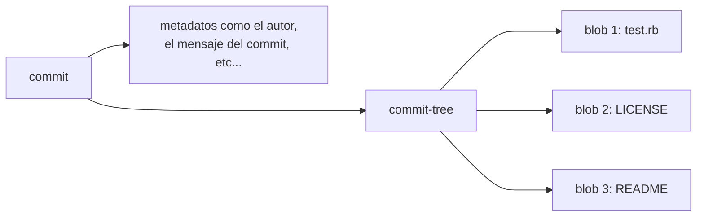

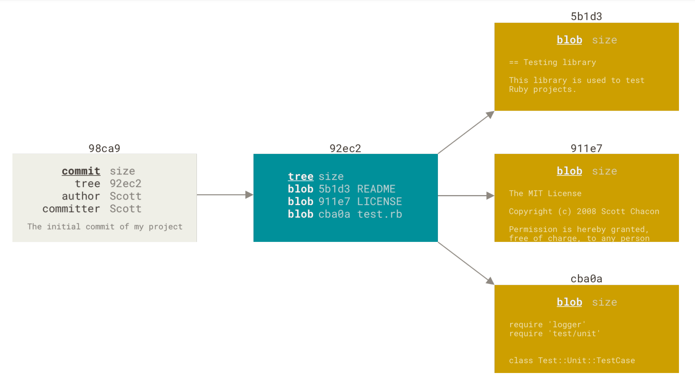

**Si despues haces unos cambios y commiteas de vuelta, el siguiente commit guarda un puntero al commit anterior**

En este gráfico, el commit con el que empezamos sería el de la izquierda del todo.
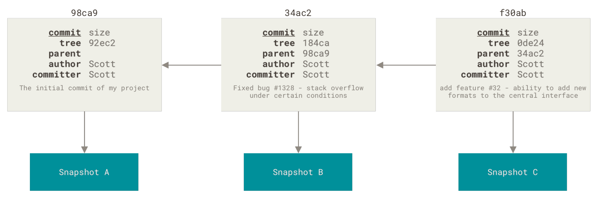

**Quiero que te quedes con algo.** Quiero que veas como las flechas van hacia la izquierda, lo ves no? Lo que esto quiere decir es que cada commit nuevo (o sea, los que van hacia la derecha), esta apuntando al commit anterior.

##### Entonces que es una branch?

Una branch es un puntero movil hacia cualquiera de estos commits.
Cada vez que haces un commit, **el puntero de la branch main/master** (o en la que estés haciendo commits) **se mueve y apunta hacia el último commit**.

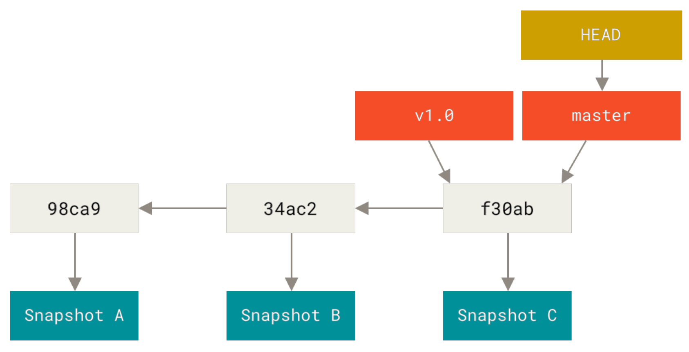

> 📝 **Qué era HEAD?**
>
> El HEAD es un puntero especial que apunta hacia **el último commit de tu branch actual**.
> Cambia a donde apunta cuando haces `git commit` o `git checkout`.

> 🏆 Si hasta este punto entendiste, te tengo que felicitar, yo la primera vez estuve como 1 hora hasta que lo entendí, fue el viaje de tren más entretenido de mi vida.

#### Creando una nueva branch

> 🍵 Esta sección es un poco más humana, es más larga pero no taaaan dificil.

**¿Qué pasa cuando creas una nueva branch?** Simplemente se **hace un nuevo puntero** el cual podes mover libremente. Por ejemplo, supongamos que querés crear una nueva branch llamada "testing". Para eso, usas `git branch`:

```bash
git branch testing
```

Esto crea un nuevo puntero al commit en el que ya estás:

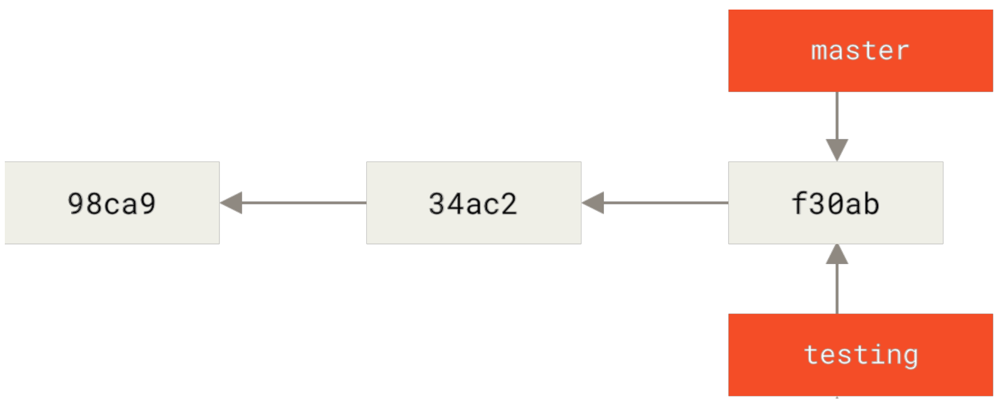
En gris los commits, y el naranja las branchs

Ahora tenés dos branchs que apuntan al mismo commit.

Cómo hace Git para saber en que branch estás actualmente?
Para esto tiene un **puntero especial llamado HEAD**, el cual apunta a la branch en la que estás parado.

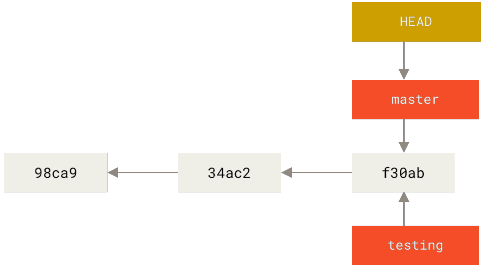

Podes ver esto facilmente usando `git log`

```
git log --oneline --decorate

f30ab (HEAD -> master, testing) Add feature #32 - ability to add new formats to...
34ac2 Fix bug #1328 - stack overflow under certain conditions
98ca9 Initial commit
```

Ahí podés ver como:

- Las branchs `master` y `testing` estan justo lado del commit f30ab
- HEAD apunta a `master` (literalmente dice HEAD -> master)

#### Switcheando branches

Para cambiar a una branch existente, usas el comando `git checkout`. Vamos a cambiar a la branch `testing`

```bash
git checkout testing
```

Esto hace que `HEAD` apunte a la branch `testing`

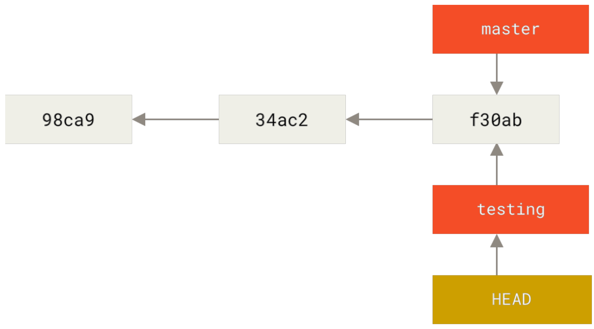

Cuál es la importancia de eso? Bueno, imaginate que moidificamos `test.rb` y hacemos otro commit:

```bash
git add test.rb
git commit -m "Hacer unos cambios"
```

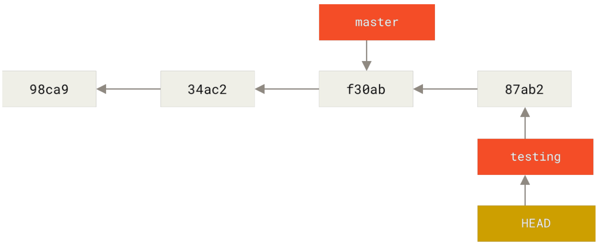

Esto es interesante, porque ahora tu rama `testing` avanzó, pero tu branch `master` todavía apunta al commit en el que estabas cuando hiciste `git checkout` para cambiar de branches.

Volvamos a la branch master

```bash
git checkout master
```

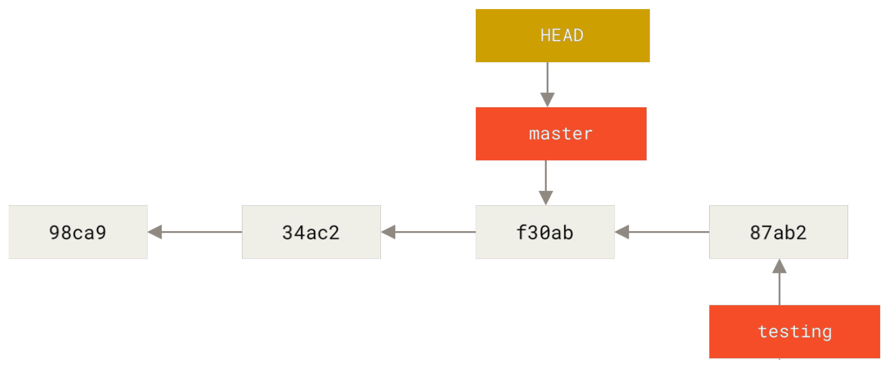

Ese comando hizo 2 cosas:

1. Movio `HEAD` de vuelta a la branch master
2. Revirtió los cambios que hiciste, dejando el working tree igualito a como estaba en el último commit que hiciste en master.

Eso supone que los cambios que hagas a partir de ahora, van a divergir de una versión anterior del proyecto (o sea, van a divergir de master). _Basicamente, hace un rewind del trabajo que hiciste en `testing`, para que puedas ir en otra dirección_

> **ℹ️ Switchear de branches cambia los archivos en tu working directory**
>
> Es importante destacar que cuando cambias a una branch en Git, los archivos
> de tu directorio de trabajo cambian.
> Si cambias a una branch antigua, tu directorio de trabajo retrocederá para verse como lo hacía la última vez que confirmaste un cambio en dicha branch.
>
> Si Git no puede hacer el cambio limpiamente, directamente no te va a dejar cambiar de branch.

Hagamos algunos cambios más y commiteemoslos

```bash
git add test.rb
git commit -m "hacer AÚN más cambios"
```

Ahora el historial del proyecto cambió:

1. Creaste una branch de `testing` y trabajaste en esa branch, y commiteaste tu trabajo
2. Volviste a tu branch `master` e hiciste un poco de trabajo, y lo commiteaste

Ambos cambios estan aislados en branchs separadas, siempre podes switchear ida y vuelta entre esas branches, y despues las vas a poder **mergear**. Todo lo que hiciste fueron unos simples y sencillos `branch`, `checkout` y `commit`.

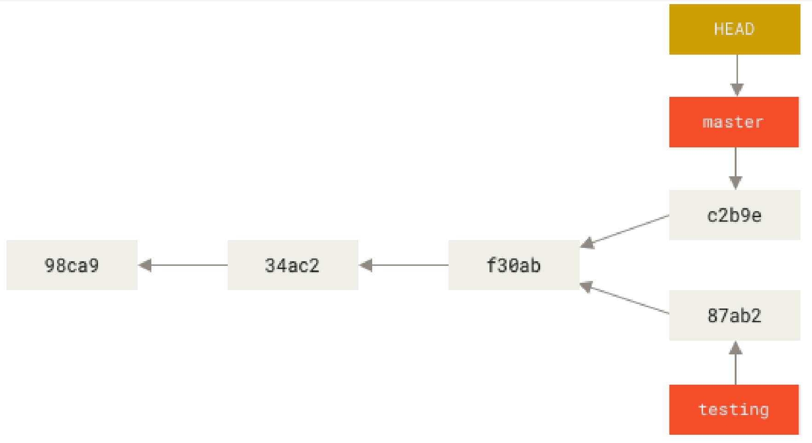

### Branching y Merging básico, rebase

Creo que si llegaste hasta este punto, tenés unas buenas bases de git, y vas a poder entender lo siguiente.

Busca el libro Pro Git de Scott Chacon y Ben Straub. El libro es gratuito y open source.
Este es el link: https://git-scm.com/book/en/v2

Leete, de la sección "Git Branching", las siguientes subsecciones

- Basic Branching and Merging
- Branch Management
- Branching Workflows
- Remote Branches
- Rebasing

## Felicitaciones!

Felicitaciones! Ya sabés mas de Git que el programador promedio.
